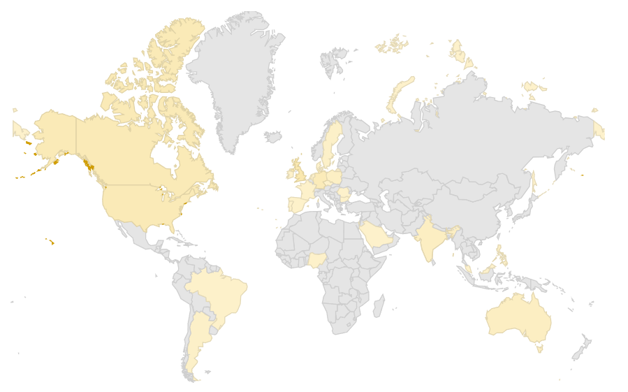

# Get on the show!

## **This is your episode, so you get to \</rant> about whatever you want.**

We love your rants and want to hear it on our show. The Adventures in DevOps podcast, is all about getting your unique brand of insight into the world. The more controversial the idea, the better it is. **This is your opportunity to share.**

We've had quite the range of guests from [Distinguished Engineers from Google](/episodes/2024/10/10/balancing-technical-skills-in-high-stakes) reviewing the impact they had on Kubernetes to [Technology directors](/episodes/2024/09/26/mastermind-groups-are-transformative) sharing the importance of your technical and profession networks. We're almost at 300 [episodes](/episodes)!

## 🏆 Current Guest Requests
We look for **expert technical practitioners** who have **Surprising**, **Shoking**, and potentially **Controversial** stories to share.

The way the podcast works is we focus on the topic area in which—you are the expert. The topic should be technical in nature and speak to our technical audience of DevOps practitioners. Focus on what's relevant relevant today, foundational challenges, and current or frequently occurring issues in your experience are great to share. Going into a case study-like review and getting into the details always turns into a great episode.

I will add the reminder, this is not an opportunity for you to advertise your product or brand, but provide real value where you want to. If you are interested in product placement, please see [our sponsorships](../sponsorship/index.mdx).

Who you are:

* **Principal Engineers / Architects** - You've seen it all, gone deep on the technology, both what you are working on now as well as in the past. We know you have opinions, and we want to hear them.
* **EMs / Team Leads** - You hire and lead a team of engineers, you know the tech, and the problem space. Everything is nuanced, and most importantly _It Depends_.
* **Directors / CTO** - Who make the decisions on the direction of engineering. Have contended with Remote/On-Site, Distributed versus not, know their industry as well as their technology.
* **Researchers / Truth Finders / Case Studies** - It doesn't have to be published, but if you have done research and have actual numbers to share, as well as rigorous evidence, we want you on! Examples could be research done regarding the impact of AI on product delivery. Note: It must be actual research.

## 🌏 The Audience

You'll be speaking to a dynamic, engaged community of DevOps professionals and technology leaders, including:  

- **Developers & Software Architects** - architecting scalable, resilient systems for modern applications.
- **Site Reliability Engineers (SREs)** - who live and breathe uptime, incident response, and automation.
- **Engineering Managers & Directors** - navigating the challenges of hiring, productivity, and team leadership.
- **CTOs & Tech Executives** - making high-stakes decisions on architecture, strategy, and business impact.
- **Cloud & Infrastructure Specialists** - optimizing deployments across AWS, GCP, and on-prem environments.
- **AI & ML Practitioners** - integrating automation, machine learning, and data-driven operations into DevOps workflows.
- **Security & Compliance Experts** tackling the ever-evolving world of DevSecOps and governance.

Our audience thrives on learning from your real-world lived experiences, controversial insights, and deep technical discussions.

    

    
The Adventures in DevOps global audience

## 📝 Your Episode Recommendations
Not really sure what you want to talk about? That's not a problem, for every episode we try to focus on one core topic area. So it's important to try to figure out what should be your episode topic. We use these questions to help inspire topics:

* Is there anything you are really passionately working on right now, or passionate about?
* Do you have something that you keep seeing people do wrong that you want to talk about?
* Is there a really hard problem your company/org/team is facing and there aren't good answers?
* Have you seen something happen with multiple companies/customers you have worked with that feels like it keeps happening?

## 📹 Episode Recording details

We record weekly at **14:00 UTC** every Tuesday. We are somewhat flexible on the day, and can move the slot up to 2 hours later until **16:00 UTC**. The episode recordings last about an hour, so you can hopefully get in whatever you need to in that time.

Guests should be prepared for shows with:
* 1 hour and 30 minutes. We do a pre-show brief and a debrief after the show, and the extra time gives us flexibility in case there are any inevitable technology disruptions.
* Quality setup, a quite place, with sufficient lighting, where you can capture clear audio.
* As we record both audio and video the better the camera and microphone the better, but if all you have are some earphones and a laptop mic we can make that work. Running air conditions, fans, and noisy outdoors do not work. Remember this is your episode, if the listeners can't hear you, then they can't hear what you have to say.
* Practical details about their technical work, this is a technical podcast with deep and interesting questions. We don't sit around and ask you how's the weather, we'll dive straight into the complex parts of the job, the work, the company, and your thoughts on the topics. However, there is no set agenda, and the goal is not ask hard questions, but instead provide thought provoking insight. This is a recorded conversation.
* A **Pick** - If you've watched or listened to the show, you know everyone is required to bring exactly one **Pick**, something that they are really interested by at this moment, be it a book, show, tool, adventure. We'll want to share a link to that thing. So if you love protein bars, we'll ask which protein bar is your favorite.

## 📍 Ready to Join the Adventure?
The DevOps Adventures Podcast is your chance to connect with a thriving community, showcase your brand, and drive real impact in the world of DevOps and beyond. We'll send you an email so we can get to know each other before the show, and include our recording schedule so you can pick a date. Click the [Contact us](mailto:scheduling@adventuresindevops.com) button here:

import StylizedButton from '@site/src/components/stylizedButton';

<StylizedButton href="mailto:scheduling@adventuresindevops.com">
    Contact us
</StylizedButton>