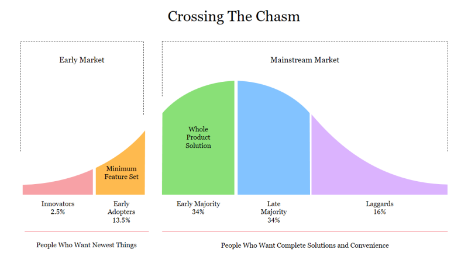

<small>

_[Transcript available](./transcript.txt)_

</small>

import GuestCallout from '@site/src/components/guestCallout';
import GuestImage from './guest.jpg';
import BrandImage from './brand.jpg';
import SponsorCallout from '@site/src/components/sponsorCallout';
import SponsorImage from './sponsor.jpg';

    <GuestCallout name="Jenna Pederson" link="https://www.linkedin.com/in/jennapederson/" image={GuestImage} brandImg={BrandImage} />
    <SponsorCallout name="Attribute" tagline="FinOps without Tagging" link="http://dev0ps.fyi/attribute" image={SponsorImage} />

Jenna Pederson, Staff Developer Relations at [Pinecone](https://www.pinecone.io/), joins us to close the loop on Vector Databases. Demystifies how they power semantic search, their role in RAG, and also unexpected applications.

Jenna takes us beyond the buzzword bingo, explaining how vector databases are the secret sauce behind semantic search. Sharing just how "red shirt" gets converted into a query that returns things semantically similar.  It's all about turning your data into high-dimensional numerical meaning, which, as Jenna clarifies, is powered by some seriously clever math to find those "closest neighbors."

The conversation inevitably veers into Retrieval-Augmented Generation (RAG). Jenna reveals how databases are the unsung heroes giving LLMs real brains (and up-to-date info) when they’re prone to hallucinating or just don’t know your company’s secrets. They complete the connection from proprietary and generalist foundational models to business relevant answers.

## Notable Facts
* [Episode: MCP: The Model Context Protocol and Agent Interactions](https://adventuresindevops.com/episodes/mcp-servers-and-agent-interactions/)
* [Crossing the Chasm](https://amzn.to/4mygNr3)

## Picks:
* Warren - [HanCenDa USB C Magnetic adapter](https://amzn.to/3K9vfIT)
* Jenna - [Keychron Alice Layout Mechanical keyboard](https://www.keychron.com/products/keychron-q10-alice-layout-qmk-custom-mechanical-keyboard?ref=adventures-in-devops) (And get a [5% discount](https://www.keychron.com/products/keychron-q10-alice-layout-qmk-custom-mechanical-keyboard?ref=adventures-in-devops) on us)
