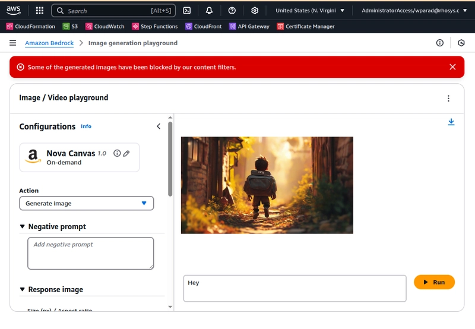

## The Blog Post Release Automation

I made this mistake this week of believing I wanted to automate, using an LLM of course, some parts of the painful podcast release cycle.

Weekly I record episodes of the podcast [Adventures in DevOps](https://adventuresindevops.com) with my awesome co-host. Of course all the episodes are available on our podcast website as well other streaming platforms.

But! Since we're a technical podcast, we decided to make our infrastructure open source (On [GitHub](https://github.com/AdventuresInDevops/Website) unfortunately), but to go further it also uses [GitHub Actions](https://github.com/AdventuresInDevops/Website/blob/main/.github/workflows/build.yml) to publish the [episodes to our website](https://github.com/AdventuresInDevops/Website/blob/main/.github/workflows/build.yml). There is of course the nasty bit of actually recording the episodes, editing the episodes, and then downloading and formatting them to make them nice.

After that is all done though, it is time to create the episode page and most importantly the cornerstone of ever podcast, **an awesome episode image**.

So let's get down to it.

## Execution
Interestingly enough, the Nova Lite model failed completely attempting to request it to actually build the command I needed to execute the model itself. Not very self-aware, you might say.

However using other models I was able to coax out the following recommendation:

With the episode saved in the transcript.txt file, and the instructions we want to run in the instructions.txt

```js
#!/usr/bin/env node

import { BedrockRuntimeClient, InvokeModelCommand } from '@aws-sdk/client-bedrock-runtime';
import fs from 'fs/promises';
import path from 'path';
import { fileURLToPath } from 'url';

// Resolve file paths
const __dirname = path.dirname(fileURLToPath(import.meta.url));
const instructionsPath = path.resolve(__dirname, 'instructions.txt');
const transcriptPath = path.resolve(__dirname, 'transcript.txt');

// Set up Bedrock client
const client = new BedrockRuntimeClient({
  region: 'eu-west-1'
});

(async () => {
  try {
    // Read both input files
    const [instructions, transcript] = await Promise.all([
      fs.readFile(instructionsPath, 'utf-8'),
      fs.readFile(transcriptPath, 'utf-8')
    ]);

    // Build prompt
    const content = `Instructions:\n${instructions}\n\nTranscript:\n---\n${transcript}\n---`;

    const payload = {
      messages: [{
        role: 'user',
        content
      }],
      // Max Token Count and other parameters: https://docs.aws.amazon.com/bedrock/latest/userguide/model-parameters-titan-text.html
      temperature: 0.7,
      top_p: 0.9,
      max_tokens: 4096
    };

    // Invoke the model
    const command = new InvokeModelCommand({
      modelId: 'amazon.nova-lite-v1:0',
      contentType: 'application/json',
      accept: 'application/json',
      body: JSON.stringify(payload)
    });

    const response = await client.send(command);

    // Decode and print response
    const responseBody = await response.body.transformToString();
    console.log('✅ Model response:\n');
    console.log(responseBody.output.message.context);
  } catch (err) {
    console.error('❌ Failed to invoke model:', err);
    process.exit(1);
  }
})();
```

And that's it, we can take the output create a pull request and then release the episode.


## Troubleshooting

Of course nothing works the first time, and for us the first issue is

```
Failed to invoke model: ValidationException: Invocation of model ID amazon.nova-lite-v1:0 with on-demand throughput isn't supported. Retry your request with the ID or ARN of an inference profile that contains this mode.
```

Okay turns out there is some magic that it takes to run the Nova model in other regions, so instead of trying to get that to work, we'll switch to the region `us-east-1`.

```
Malformed input request: #: required key [messages] not found, please reformat your input and try again.
```

Hmmm, weird, it turns out there have been some serious changes to the API, in which the documentation is not really up to date. So figuring out the correct parameters is actually a bit of a problem.

But setting the payload as just:

```js
const payload = {
      messages: [{
        role: 'user',
        content: [{
          // type: "text",
          text: inputText
        }]
      }]
      // Max Token Count and other parameters: https://docs.aws.amazon.com/bedrock/latest/userguide/model-parameters-titan-text.html
      // temperature: 0.7
      // top_p: 0.9,
      // max_tokens: 4096
    };
```

Solves most of this problem.



Although one problem we keep running into is that the Nova Modals "Content" filter keeps blocking itself. Even sending the very innocuous "hey" to the model to generate three images, fails after the first one.

Success!?

## The podcast image

The next step is run the generator a second time, but this time use the output from the first step as the input to generate an image relevant to the podcast.

There are a couple of changes that have to be made.

1. We don't need the transcript anymore since we already have a summary.
2. We need to pass an input image, we don't want some random picture we want something that is brand aware.
3. The output will be an image as well.

So instead we'll use the Nova Canvas model: `amazon.nova-canvas-v1:0` with the parameters:

```js
const payload = {
      messages: [
        {
          role: 'user',
          content: [
            { text: inputText },
            {
              image: {
                format: 'jpeg',
                source: {
                  bytes: (await fs.readFile(logoImage)).toString('base64')
                }
              }
            },
            {
              image: {
                format: 'png',
                source: {
                  bytes: (await fs.readFile(referenceImage)).toString('base64')
                }
              }
            }
          ]
        }
      ]
    };
```

## The result

We'll I think pictures are way more expressive than words, so check out the latest episode here on [Adventures in DevOps](https://adventuresindevops.com/episodes) to see how exactly well we did!

## Our Verdict

Nova is not ready for prime time. For now, we are going to try out some of the other models offered through Bedrock and focus on getting more high quality content. Quality and reliability are crucial here as we aim to cut down on time to create the episode releases.