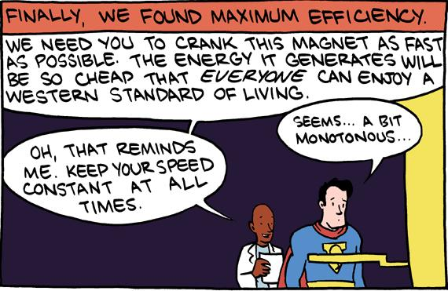

import GuestCallout from '@site/src/components/guestCallout';
import GuestImage from './guest.jpeg';
import BrandImage from './brand.jpeg';

<GuestCallout name="Aimee Knight" link="https://www.linkedin.com/in/aimeemarieknight/" image={GuestImage} brandImg={BrandImage} />

In this episode, Aimee Knight, an expert in Site Reliability Engineering (SRE) whose experience hails from Paramount and NPM, joins the podcast to discuss her journey into SRE, the challenges she faced, and the strategies she employed to succeed. Aimee shares her transition from a non-traditional background in JavaScript development to SRE, highlighting the importance of understanding both the programming and infrastructure sides of engineering. She also delves into the complexities of SRE at different scales, the role of playbooks in incident management, and the balance between speed and quality in software development.

Aimee discusses the impact of AI and machine learning on SRE, emphasizing the need for responsible use of these tools. She touches on the importance of understanding business needs and how it affects decision-making in SRE roles. The conversation also covers the trade-offs in system design, the challenges of scaling applications, and the importance of resilience in distributed systems. Aimee provides valuable insights into the pros and cons of a career in SRE, including the importance of self-care and the satisfaction of mentoring others.

The episode concludes with us discussing some of the hard problems such as the on-call burden for large teams, and the technical expertise an org needs to maintain higher complexity systems. Is the average tenure in tech decreasing, we discuss it and do a deep dive on the consequences in the SRE world.

## Picks
    - [Warren's Technical Blog](http://dev.to/wparad)
    - Warren: [The Fifth Discipline by Peter Senge](https://www.amazon.com/Fifth-Discipline-Fieldbook-Strategies-Themes/dp/0787964503)
    - Aimee: Sleep Token (Band) - [Caramel](https://youtu.be/4iSvoQNfrrk?si=7Fz9BbJ3AM0gnw7j), [Granite](https://youtu.be/om4dEGKnEmw?si=zi87FTA2RsYc8Xif)
    - Will: [The Bear Grylls Celebrity Hunt on Netflix](https://www.netflix.com/ch-en/title/81701547)
    - Jillian: [Horizon Zero Dawn Video Game](https://www.horizon.game/)